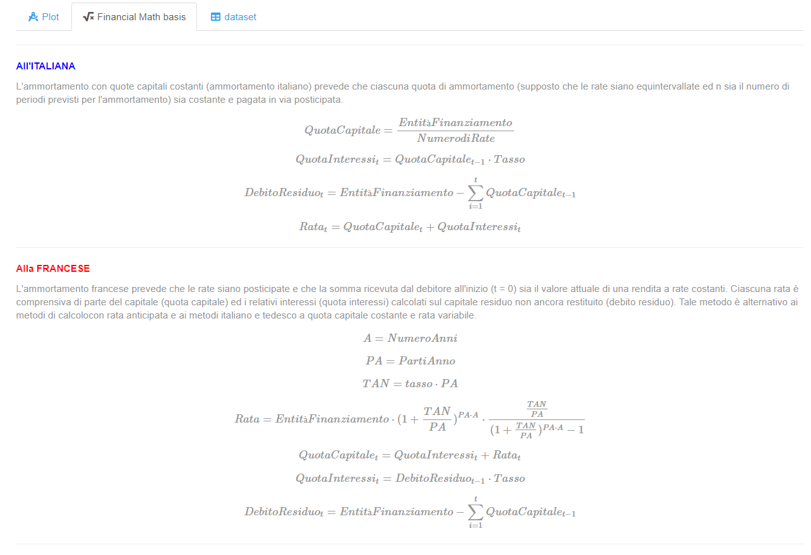
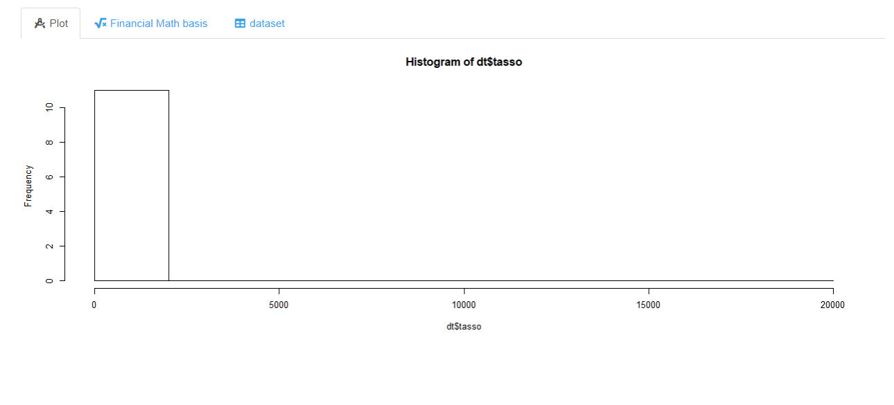
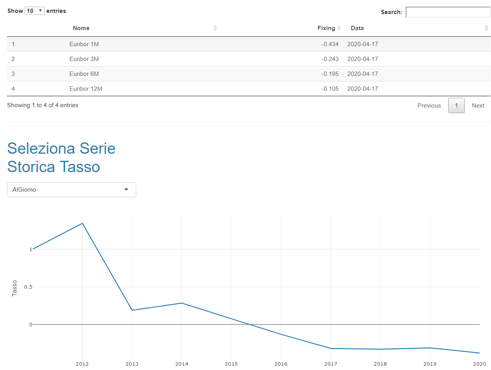

# calcola_finanziamento
simple shiny tool that computes financial information given the contract (`IN ITINERE`)

---

_this is has already been deployed even thougt it is not completed_
deployment happens
 [`HERE`](http://niccolosalvini.shinyapps.io/calcola_finanziamento)

------

### some snapshots from the _APP_

---

---

---

----

## prossime features:

1. mettere griglia di importanti indicatori per finanziamento
  1. TAE
  2. TAEG
  3. Totale interessi 
  4. Importo rata
2. ammoratamento tedesco e restituzione unica
3. ottimizzazione performance tramite reactive dentro server
4. mettere serie storica tassi completa 
