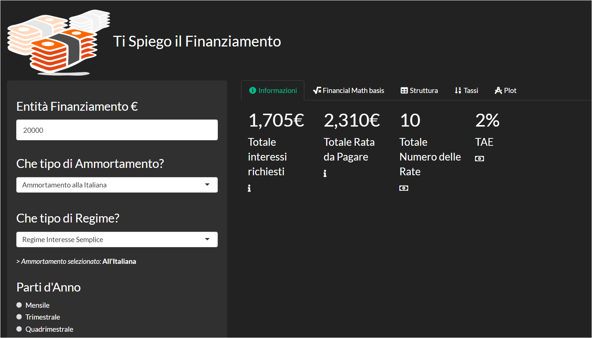

Calcola\_Finanziamento
================
Niccolò Salvini
27/4/2020

## Deployment happens

On the shiny sever
[`HERE`](http://niccolosalvini.shinyapps.io/calcola_finanziamento)

## Description

I noticed that people in the business of assessing *usury* are using old
tools such as Excel and 90’ visualization, not even interactive. The
point is to make it easier to non technicals to percieve the differences
among appling different mortages schemes.

I have 2 configurations for mortages:

  - italiano

  - francese

I have 2 configuations for interest rates.

  - simple

  - composed

## Visuals

 

## Usage

You just need to type data from you financial summary, such as the total
amount for the moratge, years according to which you have to repy it,
the type of payment (3 months, 6 months, whatever), and all the other
info required to compute a term structure.

## Project status

The project is not finished yet. But it is still deployed and you can
play with numbers and interests. **in ITINERE**

## prossime features:

1.  mettere griglia di importanti indicatori per finanziamento
2.  TAEG
3.  costi di inizio pratica
4.  ammoratamento tedesco e restituzione unica
5.  ottimizzazione performance tramite reactive dentro server
6.  mettere serie storica tassi completa

## License
