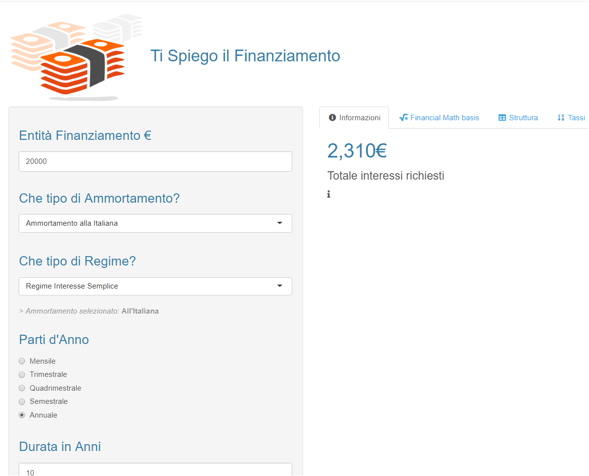

# calcola_finanziamento
simple shiny tool that computes financial information given the contract (`IN ITINERE`)

---

_this is has already been deployed even thougt it is not completed_
----> deployment happens [`HERE`](http://niccolosalvini.shinyapps.io/calcola_finanziamento)

### some snapshots from the _APP_

---

---

---

### Road map:

  - far vedere come è strutturato il finanziamento
  - fammi vedere quanto debuto rimane ad un determianto tempo t
  - invertire tabella nel primo panel e il primo panel nel terzo
  - sistemare download button
  - 
  
- plotta grafici
  - andamento tasso di interesse
  - andamento quota capitale
  - andamento quota interessi 
  - andamento debito residuo 
  - comparazione con tassi d'interesse anatocismo 